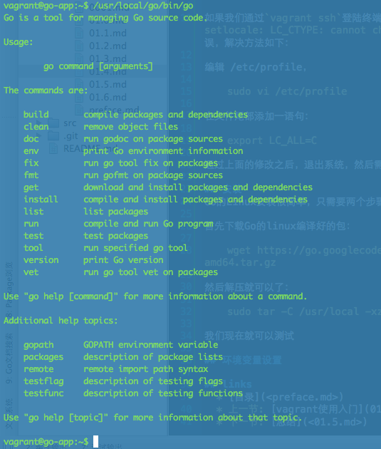

# 4 Go环境安装配置

前面我们已经安装好了虚拟环境，那么接下来就需要在虚拟环境中安装Go环境了，因此你首先要`vagrant up`把虚拟机开起来，然后通过`vagrant ssh`登陆到系统中。

## Ubuntu环境设置
我们需要修改配置文件`/etc/default/locale`设置为：

	LANG="en_US.UTF-8"
	LANGUAGE="en_US:en"
	
如果我们通过`vagrant ssh`登陆终端，按tab键出现`bash: warning: setlocale: LC_CTYPE: cannot change locale (zh_CN.UTF-8)` 的警告错误，解决方法如下：

编辑 /etc/profile，

	sudo vi /etc/profile

在文件尾部添加一语句：

	export LC_ALL=C

通过上面的修改之后，退出系统，然后需要重启虚拟机`vagrant reload`.

## 安装
Go的Linux安装很简单，只需要两个步骤：下载、解压

首先下载Go的linux编译好的包：

	wget https://go.googlecode.com/files/go1.1.1.linux-amd64.tar.gz

然后解压就可以了：

	sudo tar -C /usr/local -xzf go1.1.1.linux-amd64.tar.gz

我们现在就可以测试:

	/usr/local/go/bin/go

如果出现如下的界面，那么说明已经安装成功了。

	

## 环境变量设置
上面我们已经成功安装了Go，那么接下来我们配置一些

## links  
  * [目录](<preface.md>)
  * 上一节: [vagrant使用入门](01.3.md)
  * 下一节: [总结](<01.5.md>)